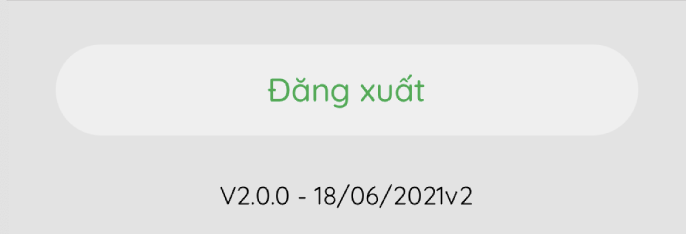

# @nghinv/react-native-codepush-manage

Loading an overlay when running long tasks in the react-native application.

---


[![Version][version-badge]][package]
[![MIT License][license-badge]][license]
[![All Contributors][all-contributors-badge]][all-contributors]

# Installation

## Installing the package

* Use yarn

```sh
yarn add @nghinv/react-native-codepush-manage
```

* Use npm

```sh
npm install @nghinv/react-native-codepush-manage
```

 - peerDependencies
 
```sh
yarn add react-native-code-push react-native-device-info
```




# How to use

## Connect with Root Component

you can use `withCodePush` or `CodePushProvider` to wrapped Root component

### Use withCodePush

- Connect `withCodePush` with `Root Component`

```javascript
  import { withCodePush } from '@nghinv/react-native-codepush-manage';

  ....

  // Default = {
  //   checkFrequency: codePush.CheckFrequency.ON_APP_RESUME,
  //   installMode: codePush.InstallMode.ON_NEXT_RESTART,
  // }
  const codePushOptions = {};

  export default withCodePush(codePushOptions)(RootComponent);
```

### Use CodePushProvider

- Wrapped `CodePushProvider` with `Root Component`

```javascript
  import { CodePushProvider } from '@nghinv/react-native-codepush-manage';

  ....

  return (
    <CodePushProvider>
      <RootComponent />
    </CodePushProvider>
  )
```

## Use AppVersion

- Use hook function `useCodePush`

```js
  const { status, progress } = useCodePush();
```

- Use `AppVersion` component

```js
  import { AppVersion } from '@nghinv/react-native-codepush-manage';


  return (
    <View>
      <AppVersion 
        buildDate='02/09/2021'
        statusTitle={{
          Updating: 'Updating',
          Installing: 'Installing',
          NeedToRestart: 'Need to restart',
        }}
      />
    </View>
  )
```

# Property


## AppVersion property

| Property | Type | Default | Description |
|----------|:----:|:-------:|-------------|
| title | `String` | `null` | Title of app version |
| style | `ViewStyle` | `null` | Container style |
| titleColor | `String` | `null` | Title color |
| titleStyle | `TextStyle` | `null` | Title style |
| onPress | `() => void` | `null` |  |
| enableRestartOnPress | `Bool` | `null` | press to restart app |
| enableSyncOnPress | `Bool` | `null` | press to sync code push |
| buildDate | `String` | `null` | App build date |
| statusTitle | `StatusTitleStyle` | `null` |  |
| titleProps | `TextProps` | `null` |  |

<br>

### StatusTitleStyle

| Property | Type | Default | Description |
|----------|:----:|:-------:|-------------|
| Updating | `String` | `Updating` |  |
| Installing | `String` | `Installing` |  |
| NeedToRestart | `String` | `Need to restart` |  |

---
## Credits

- [@Nghi-NV](https://github.com/Nghi-NV)

[version-badge]: https://img.shields.io/npm/v/@nghinv/react-native-codepush-manage.svg?style=flat-square
[package]: https://www.npmjs.com/package/@nghinv/react-native-codepush-manage
[license-badge]: https://img.shields.io/npm/l/@nghinv/react-native-codepush-manage.svg?style=flat-square
[license]: https://opensource.org/licenses/MIT
[all-contributors-badge]: https://img.shields.io/badge/all_contributors-1-orange.svg?style=flat-square
[all-contributors]: #contributors
